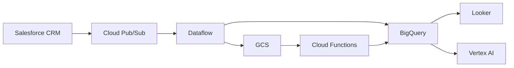
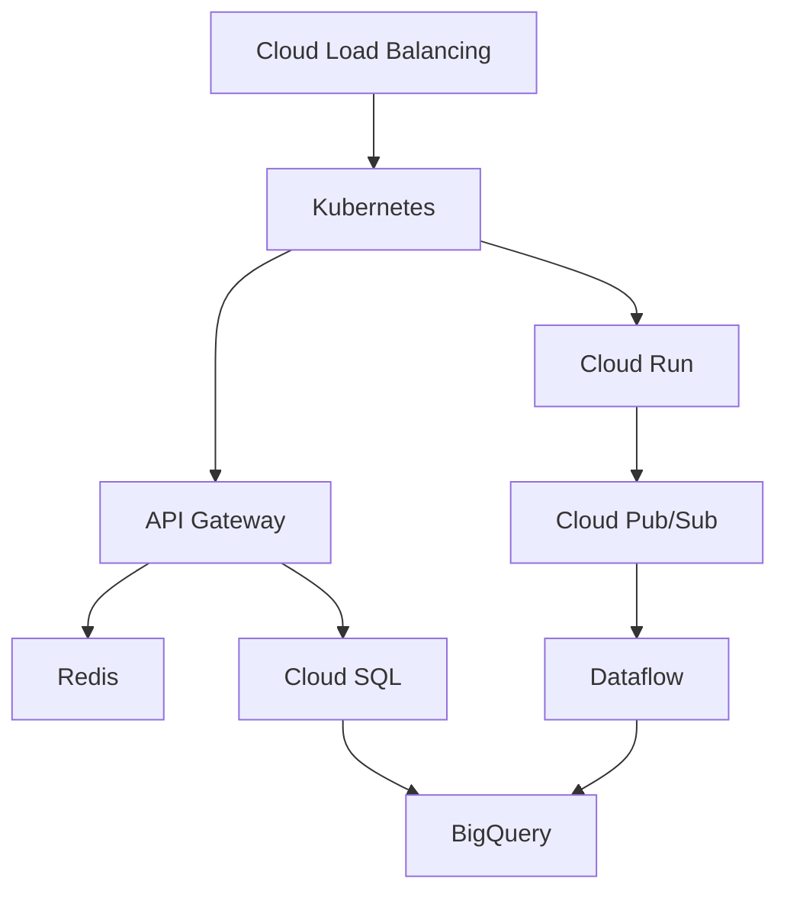

# GCP Data Pipeline Architecture

```mermaid
flowchart LR
    A[Salesforce CRM] --> B[Cloud Pub/Sub]
    B --> C[Dataflow]
    C --> D[BigQuery]
    D --> E[Looker]
    C --> F[GCS]
    F --> G[Cloud Functions]
    G --> D
    D --> H[Vertex AI]
```

# Microservices Architecture

```mermaid
flowchart TB
    LB[Cloud Load Balancing] --> GKE[Kubernetes]
    GKE --> SVC1[API Gateway]
    GKE --> SVC2[Cloud Run]
    SVC1 --> CACHE[Redis]
    SVC1 --> DB[Cloud SQL]
    SVC2 --> PUB[Cloud Pub/Sub]
    PUB --> DF[Dataflow]
    DF --> BQ[BigQuery]
    DB --> BQ
```
