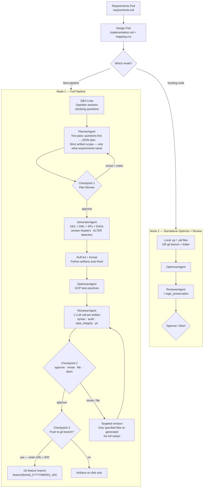
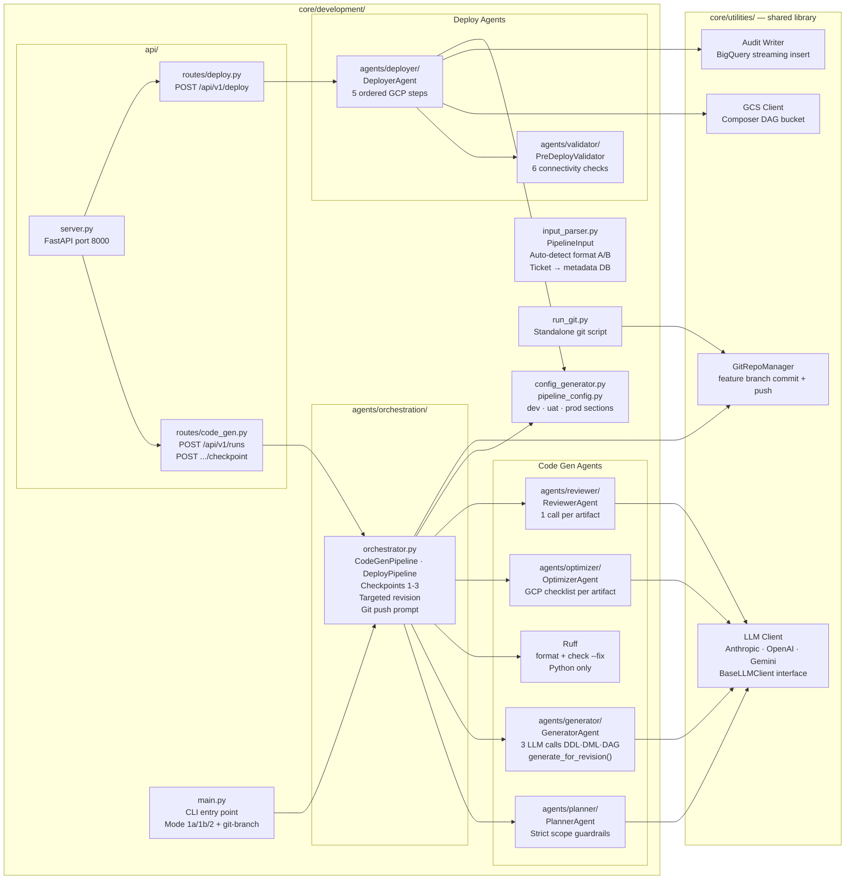
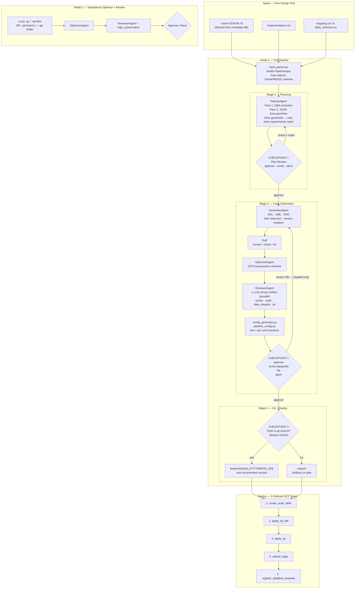

# Development Pod — Implementation Guide

> **What this pod does**
>
> An end-to-end, agent-driven data pipeline code generator that sits between the
> **Design Pod** (requirements + Implementation.md) and a live GCP environment.
>
> Given a Jira ticket ID (or `Implementation.md + mapping.csv`), the pod **plans**,
> **generates**, **optimizes**, **reviews**, and optionally **deploys** production-ready
> BigQuery DDL/DML, stored procedures, and Airflow DAGs — with a human approval gate
> at every stage.
>
> Key principles:
> - **Ticket-first input** — `--ticket SCRUM-75` fetches impl doc + mapping CSV directly
>   from the metadata DB; file paths still work as a fallback
> - **Two-pass planning** — Planner first extracts clarifying questions (lightweight call),
>   runs an interactive Q&A, then generates a full structured JSON plan
> - **Strict requirements fidelity** — only generates artifacts, tables, and DAG files
>   explicitly named in the requirements document; staging tables, quarantine tables, PII
>   topics, and audit are only included when requirements explicitly call for them
> - **Targeted revision** — Checkpoint 2 `revise` re-generates only the files the user
>   specifies (by name in notes, by number in the file picker, or by `file <name>` command);
>   no full restarts
> - **Per-file change prompt** — after generation, `file <name>` at Checkpoint 2 lets
>   users request surgical changes to individual files without affecting the rest
> - **Git push always offered** — Checkpoint 3 appears after every successful generation,
>   even without `--git-repo-url`; prompts for repo URL and PAT interactively if needed
> - **Optimizer from git branch** — Mode 2 can load files directly from a git branch +
>   folder instead of local paths (`--git-branch` + `--git-folder`)
> - **No MCP layer** — agents run directly from Design Pod file outputs
> - **Token efficiency** — large static documents cached via Anthropic prompt caching;
>   downstream agents read from cache
> - **Provider-agnostic** — switch Claude Agent SDK → Anthropic → OpenAI → Gemini with
>   one flag; zero code changes
> - **GCP best practices embedded** — filter-before-join, partition pruning, stored
>   procedures, Cloud Logging JSON, Composer `Variable.get()`, Dataflow `COST_OPTIMIZED`
> - **Git integration** — artifacts committed to `feature/{ticket}_{YYYYMMDD}_v{N}` with
>   auto-increment; optional remote push
> - **ENV-driven deployment** — generated `pipeline_config.py` holds dev / uat / prod
>   sections; set `ENV=uat` at deploy time — no code changes needed
> - **Version headers** — every generated file carries a version history block; ALTER runs
>   append to existing history

---

## Where This Pod Fits — DEAH Pipeline Context



---

## Agent Architecture



---

## Problem We Solve

Data engineers spend 2–4 days hand-authoring repetitive BigQuery DDL, SCD merge
scripts, stored procedures, and Airflow DAGs from design documents. A single pipeline
(source → staging → core) can require 10–20 files, all of which must follow strict GCP
best practices. Mistakes are hard to catch in manual review and expensive to fix in
production.

**This pod eliminates that authoring cost and enforces best practices automatically.**

---

## Operating Modes

### Mode 1 — Full Pipeline (new pipeline from design documents)

Takes `Implementation.md + mapping.csv` from the Design Pod and produces
production-ready artifacts through a fully automated, human-gated pipeline.

```
Input:   Implementation.md  +  mapping.csv   (or ticket ID → fetched from metadata DB)
Output:  DDL · DML · Stored Procedures · Airflow DAGs
         pipeline_config.py (dev/uat/prod sections)
         PLAN.md · REVIEW_REPORT.md · MANIFEST.json
         Git feature branch (offered at Checkpoint 3)
         Live GCP deployment (optional)
```

**Entry points:**
| Sub-mode | Command | When to use |
|----------|---------|-------------|
| 1a — Ticket | `--ticket SCRUM-75` | Ticket exists in metadata DB (recommended) |
| 1b — Files | `--impl doc.md --mapping map.csv` | Local files, no DB |
| Dry run | `--dry-run` | Plan only, no code generation |

### Mode 2 — Standalone Optimize + Review (existing code)

Takes any existing `.py` / `.sql` files and runs only the Optimizer and Reviewer —
no planning or generation. Includes a `logic_preservation` check.

```
Input:   Existing .py / .sql files   — from local paths OR a git branch + folder
Output:  Improved files + REVIEW_REPORT.md + logic_preservation verdict
```

**Entry points:**
| Sub-mode | Command | When to use |
|----------|---------|-------------|
| Local files | `--optimize --files f1.py f2.sql` | Files already on disk |
| Git branch | `--optimize --git-branch <branch> --git-repo-url <url>` | Files on a remote branch |
| Git branch + folder | add `--git-folder pipelines/SCRUM-75` | Specific subfolder in the branch |

---

## Human Checkpoints

No code reaches disk or any environment without an explicit human decision.

| # | Triggered when | Available options | On revise / select |
|---|---------------|-------------------|--------------------|
| 0 | Before planning — Q&A loop | Operator answers clarifying questions | Answers appended to plan context |
| 1 | After PlannerAgent writes PLAN.md | `approve` · `revise` · `details` · `abort` | Notes → `ctx.human_notes`; Planner re-runs |
| 2 | After Generator + Ruff + Optimizer + Reviewer | `approve` · `revise` · `file <name>` · `details` · `abort` | Only named/selected files re-generated; others unchanged |
| 3 | After code approval — always, even without `--git-repo-url` | `yes` (push) · `no` (skip) | If yes and no URL configured, prompted interactively |
| Optimize | After Optimizer + Reviewer (Mode 2) | `approve` · `abort` | — |

### Checkpoint 2 — Per-File Change Options

At Checkpoint 2 the user can target changes at individual files without re-running everything:

```
  Options:  approve | revise | file <name> | details | abort

  > file dag_employees_extract.py
  What change do you want in dag_employees_extract.py: add exponential backoff to the extract task

  > file 2                          ← select by number from the displayed list
  > file stg_emp                    ← partial name match works too
```

**Revise mode** — targeted, no full restarts:
- Notes mentioning a file name (`"fix the merge in stg_employees_ddl.sql"`) → only that file is re-generated
- Notes without a file name → file picker appears showing numbered list; user picks one or more
- All other artifacts retain their current content and cached review results

### Checkpoint 3 — Git Push (always offered)

Checkpoint 3 appears after every successful code generation, regardless of whether
`--git-repo-url` was passed on the command line.

```
  CHECKPOINT 3 — PUSH TO GIT BRANCH
  ─────────────────────────────────────────────────────────────────────
  Artifacts saved to : output/SCRUM-75/
  Proposed branch    : feature/SCRUM-75_20260416_v1

  Push to git branch? [yes / no]: yes

  Git repository URL required. Example: https://github.com/org/repo
  Git repo URL: https://github.com/my-org/my-pipelines

  Personal Access Token (PAT) required. Input will not be echoed.
  PAT: ••••••••••••

  Git: pushed to origin/feature/SCRUM-75_20260416_v1
```

If `GIT_REPO_URL` and `GIT_PAT` are already in environment or `.env`, they are used
automatically without asking.

---

## Code Generation Guardrails

The Planner and Generator agents enforce these rules unconditionally:

| Rule | Detail |
|------|--------|
| **Strict artifact scope** | Only files explicitly named in the requirements go into `artifacts_to_generate`. No extras. |
| **Staging tables** | `stg_*` tables only appear in the plan when explicitly named in the requirements document. Never auto-added per source table. |
| **Quarantine tables** | Only generated if the requirements document explicitly names them. |
| **DAG files** | Only DAG files explicitly named in requirements are generated. No "one extract + one process DAG" assumption. |
| **Audit logging** | `audit_pipeline_runs` DDL and `sp_log_audit` only generated when the requirements explicitly mention audit or pipeline tracking. |
| **PII** | PII comments/tags only added to columns marked `is_pii=True` in the mapping CSV or explicitly described as sensitive. PII is never raised as a blocker unless requirements address it. |
| **No speculative extras** | Config files, runbooks, migration scripts, extra stored procedures — none generated unless in requirements. |

---

## Full System Flow



---

## Commands — All Entry Points

All commands run from `DEAH/core/development/` unless otherwise noted.

---

### 1 — One-Time Setup

```bash
cd DEAH/core/development
pip install -r requirements.txt

# Default LLM provider is Claude Agent SDK (no API key — uses active Claude Code session)
# To switch to Anthropic direct:
export ANTHROPIC_API_KEY="sk-ant-..."

# Optional GCP defaults (avoids passing --project / --dataset every run)
export PROJECT_ID="my-gcp-project-dev"
export DATASET_ID="my_dataset_dev"
export ENV="dev"                        # dev | uat | prod

# On GCP VM — authenticate with ADC
gcloud auth application-default login
```

---

### 2 — Mode 1a: Full Pipeline via Ticket ID (recommended)

Fetches `Implementation.md` + `mapping.csv` from the metadata DB using the ticket ID.

```bash
# Minimal — project/dataset from env vars
python main.py --ticket SCRUM-75

# With explicit project/dataset
python main.py --ticket SCRUM-75 \
  --project my-gcp-project-dev \
  --dataset my_dataset_dev

# Dry run — plan only, no code generation
python main.py --ticket SCRUM-75 --dry-run

# Force regeneration (ignore cached run)
python main.py --ticket SCRUM-75 --force

# Different environment
python main.py --ticket SCRUM-75 --env uat

# Different region
python main.py --ticket SCRUM-75 --region europe-west1

# Different model
python main.py --ticket SCRUM-75 --model claude-opus-4-6
```

---

### 3 — Mode 1b: Full Pipeline via Explicit Files

```bash
# Standard mapping.csv
python main.py \
  --impl   path/to/Implementation.md \
  --mapping path/to/mapping.csv \
  --project my-gcp-project-dev \
  --dataset my_dataset_dev

# Raw source schema (Oracle/MySQL schema export — auto-converted to mapping.csv)
python main.py \
  --impl   path/to/Implementation.md \
  --mapping path/to/table_schema.csv

# requirements.json from Design Pod (auto-converted to markdown)
python main.py \
  --impl   path/to/requirements.json \
  --mapping path/to/mapping.csv
```

---

### 4 — Mode 1 with Git Push Pre-Configured

Branch is auto-named `feature/{ticket}_{YYYYMMDD}_v{N}` and version-incremented.

```bash
# Commit to feature branch + prompt to push at Checkpoint 3
python main.py \
  --ticket SCRUM-75 \
  --git-repo-url https://github.com/org/repo \
  --git-pat ghp_xxxxxxxxxxxx

# Commit AND push automatically (skips Checkpoint 3 push prompt)
python main.py \
  --ticket SCRUM-75 \
  --git-repo-url https://github.com/org/repo \
  --git-pat ghp_xxxxxxxxxxxx \
  --push

# Via env vars (avoids passing PAT on the command line)
export GIT_REPO_URL="https://github.com/org/repo"
export GIT_PAT="ghp_xxxxxxxxxxxx"
python main.py --ticket SCRUM-75
```

> **Note:** Even without `--git-repo-url`, Checkpoint 3 will appear after generation and
> offer to push. It prompts for the URL and PAT interactively if they are not in the environment.

---

### 5 — Mode 1: Switch LLM Provider

```bash
# Claude Agent SDK (default — no API key, uses Claude Code OAuth session)
python main.py --ticket SCRUM-75 --provider claude-code-sdk

# Anthropic direct (API key required)
export ANTHROPIC_API_KEY="sk-ant-..."
python main.py --ticket SCRUM-75 --provider anthropic

# OpenAI
export OPENAI_API_KEY="sk-..."
python main.py --provider openai \
  --impl path/to/Implementation.md --mapping path/to/mapping.csv

# Gemini
export GEMINI_API_KEY="..."
python main.py --provider gemini \
  --impl path/to/Implementation.md --mapping path/to/mapping.csv
```

---

### 6 — Mode 2: Optimize + Review — from Local Files

Runs Optimizer + Reviewer on existing files. No planning or generation.

```bash
# Single file
python main.py --optimize \
  --files output/SCRUM-75/dag/dag_employees_extract.py

# Multiple files (mixed SQL + Python)
python main.py --optimize \
  --files output/SCRUM-75/ddl/stg_employees.sql \
          output/SCRUM-75/dag/dag_employees_extract.py \
          output/SCRUM-75/sp/sp_merge_employees.sql

# All files in a directory (pass them explicitly via shell glob)
python main.py --optimize \
  --files output/SCRUM-75/ddl/*.sql output/SCRUM-75/dag/*.py

# With project context (improves review quality)
python main.py --optimize \
  --files output/SCRUM-75/dag/dag_employees_extract.py \
  --project my-gcp-project-dev \
  --dataset my_dataset_dev
```

---

### 7 — Mode 2: Optimize + Review — from Git Branch

Fetches files directly from a remote git branch and folder, then runs Optimizer + Reviewer.
Useful when starting optimization without manually checking out the branch.

```bash
# Optimize all .sql and .py files from the branch root
python main.py --optimize \
  --git-branch  feature/SCRUM-75_20260416_v1 \
  --git-repo-url https://github.com/org/repo \
  --git-pat     ghp_xxxxxxxxxxxx

# Optimize files from a specific folder within the branch
python main.py --optimize \
  --git-branch  feature/SCRUM-75_20260416_v1 \
  --git-repo-url https://github.com/org/repo \
  --git-pat     ghp_xxxxxxxxxxxx \
  --git-folder  pipelines/SCRUM-75

# With project context
python main.py --optimize \
  --git-branch  feature/SCRUM-75_20260416_v1 \
  --git-repo-url https://github.com/org/repo \
  --git-pat     ghp_xxxxxxxxxxxx \
  --git-folder  pipelines/SCRUM-75 \
  --project     my-gcp-project-dev \
  --dataset     my_dataset_dev

# Via env vars (avoids repeating credentials)
export GIT_REPO_URL="https://github.com/org/repo"
export GIT_PAT="ghp_xxxxxxxxxxxx"
python main.py --optimize \
  --git-branch feature/SCRUM-75_20260416_v1 \
  --git-folder pipelines/SCRUM-75
```

What it loads: all `.sql` and `.py` files under the folder (excluding `__pycache__` and
hidden directories), printed before the optimizer runs:

```
  Connecting to : https://github.com/org/repo
  Branch        : feature/SCRUM-75_20260416_v1
  Folder        : pipelines/SCRUM-75

  Found 5 file(s):
    pipelines/SCRUM-75/ddl/stg_employees.sql
    pipelines/SCRUM-75/ddl/employees.sql
    pipelines/SCRUM-75/sp/sp_merge_employees.sql
    pipelines/SCRUM-75/dag/dag_employees_extract.py
    pipelines/SCRUM-75/dag/dag_employees_process.py
```

---

### 8 — Run Individual Agents Standalone

Each agent has a `run_agent.py` for isolated testing.

```bash
# Planner only — produces ExecutionPlan + PLAN.md
python agents/planner/run_agent.py \
  --impl   path/to/Implementation.md \
  --mapping path/to/mapping.csv \
  --project my-gcp-project-dev \
  --dataset my_dataset_dev

# Generator only — requires a plan JSON from the planner
python agents/generator/run_agent.py \
  --impl   path/to/Implementation.md \
  --mapping path/to/mapping.csv \
  --plan   path/to/plan.json \
  --project my-gcp-project-dev \
  --dataset my_dataset_dev \
  --output output/

# Optimizer only — reads local files, writes improved versions
python agents/optimizer/run_agent.py \
  --files output/SCRUM-75/ddl/stg_employees.sql \
          output/SCRUM-75/dag/dag_employees_extract.py \
  --project my-gcp-project-dev \
  --dataset my_dataset_dev

# Optimizer only — all files in a directory
python agents/optimizer/run_agent.py \
  --dir output/SCRUM-75/ \
  --project my-gcp-project-dev \
  --dataset my_dataset_dev

# Reviewer only
python agents/reviewer/run_agent.py \
  --dir output/SCRUM-75/ \
  --project my-gcp-project-dev \
  --dataset my_dataset_dev

# Logic-preservation review (original vs optimized)
python agents/reviewer/run_agent.py \
  --original  output/SCRUM-75/original/ \
  --optimized output/SCRUM-75/optimized/ \
  --project   my-gcp-project-dev \
  --dataset   my_dataset_dev

# Pre-deploy validator — connectivity checks without deploying
python agents/validator/run_agent.py \
  --project      my-gcp-project-dev \
  --dataset      my_dataset_dev \
  --region       us-central1 \
  --dag-bucket   my-composer-bucket \
  --composer-env my-composer-env
```

---

### 9 — Deploy to GCP Environments

Fill in `uat` and `prod` values in `output/<request_id>/config/pipeline_config.py`
before deploying to those environments.

```bash
# Deploy to dev (default environment)
python agents/deployer/run_agent.py \
  --artifacts-dir output/SCRUM-75

# Deploy to UAT — reads UAT_PROJECT_ID, UAT_DATASET_NAME from pipeline_config.py
ENV=uat python agents/deployer/run_agent.py \
  --artifacts-dir output/SCRUM-75

# Deploy to production
ENV=prod python agents/deployer/run_agent.py \
  --artifacts-dir output/SCRUM-75

# With Composer + Dataflow config
ENV=uat python agents/deployer/run_agent.py \
  --artifacts-dir    output/SCRUM-75 \
  --dag-bucket       my-composer-bucket-uat \
  --composer-env     my-composer-env-uat

# Override project/dataset explicitly (ignores pipeline_config.py)
python agents/deployer/run_agent.py \
  --artifacts-dir output/SCRUM-75 \
  --project       my-gcp-project-prod \
  --dataset       my_dataset_prod \
  --environment   prod
```

---

### 10 — Git Integration (Standalone Script)

```bash
# Configure via env vars (or .env file)
export GIT_REPO_URL="https://github.com/org/repo"
export GIT_PAT="ghp_xxxxxxxxxxxx"
export GIT_BRANCH="feature/SCRUM-75_20260416_v1"
export GIT_LOCAL_PATH="output/git_workspace"
export OUTPUT_DIR="output/SCRUM-75"

# Full flow: setup → pull → commit → push
python run_git.py

# Step-by-step
python run_git.py --action setup          # clone / verify connection
python run_git.py --action pull           # pull latest from default branch
python run_git.py --action commit         # stage + commit artifacts to feature branch
python run_git.py --action push           # push feature branch to remote
python run_git.py --action status         # show current branch + changed files

# Override per-run
python run_git.py \
  --repo   https://github.com/org/repo \
  --branch feature/SCRUM-75_20260416_v1 \
  --output output/SCRUM-75 \
  --push                                  # commit + push in one step
```

---

### 11 — API Server

```bash
# Start server
cd DEAH/core/development
uvicorn api.server:app --host 0.0.0.0 --port 8000 --reload

# Env vars for API server
export LLM_PROVIDER="anthropic"
export LLM_API_KEY="sk-ant-..."
export PROJECT_ID="my-gcp-project-dev"
export DATASET_ID="my_dataset_dev"
export ENV="dev"
export GIT_REPO_URL="https://github.com/org/repo"
export GIT_PAT="ghp_xxxxxxxxxxxx"

# Swagger UI
open http://localhost:8000/docs
```

#### Start a full pipeline run (Mode 1)

```bash
# With inline content
curl -X POST http://localhost:8000/api/v1/runs \
  -H "Content-Type: application/json" \
  -d '{
    "implementation_md": "# Pipeline spec ...",
    "mapping_csv": "source_table,source_column,...",
    "project_id": "my-gcp-project-dev",
    "dataset_id": "my_dataset_dev"
  }'
# → { "request_id": "SCRUM-75", "status": "pending" }
```

#### Poll run status

```bash
curl http://localhost:8000/api/v1/runs/SCRUM-75
# → {
#     "status": "checkpoint",
#     "checkpoint_number": 1,
#     "checkpoint_prompt": "CHECKPOINT 1 — PLAN REVIEW\n...",
#     "plan_summary": "...",
#     "quality_score": null
#   }
```

#### Submit checkpoint decisions

```bash
# Checkpoint 1 — approve plan
curl -X POST http://localhost:8000/api/v1/runs/SCRUM-75/checkpoint \
  -H "Content-Type: application/json" \
  -d '{"decision": "approve"}'

# Checkpoint 1 — revise plan with notes
curl -X POST http://localhost:8000/api/v1/runs/SCRUM-75/checkpoint \
  -H "Content-Type: application/json" \
  -d '{"decision": "revise", "notes": "Use incremental load for stg_employees"}'

# Checkpoint 2 — approve generated code
curl -X POST http://localhost:8000/api/v1/runs/SCRUM-75/checkpoint \
  -H "Content-Type: application/json" \
  -d '{"decision": "approve"}'

# Checkpoint 2 — revise specific file (targeted, no full restart)
curl -X POST http://localhost:8000/api/v1/runs/SCRUM-75/checkpoint \
  -H "Content-Type: application/json" \
  -d '{"decision": "revise", "notes": "Fix stg_employees_ddl.sql: add LOAD_DATE partition column"}'

# Checkpoint 3 — push to git
curl -X POST http://localhost:8000/api/v1/runs/SCRUM-75/checkpoint \
  -H "Content-Type: application/json" \
  -d '{"decision": "approve"}'

# Checkpoint 3 — skip git push
curl -X POST http://localhost:8000/api/v1/runs/SCRUM-75/checkpoint \
  -H "Content-Type: application/json" \
  -d '{"decision": "skip"}'

# Abort at any checkpoint
curl -X POST http://localhost:8000/api/v1/runs/SCRUM-75/checkpoint \
  -H "Content-Type: application/json" \
  -d '{"decision": "abort"}'
```

#### Optimize + Review via API (Mode 2)

```bash
curl -X POST http://localhost:8000/api/v1/optimize-review \
  -H "Content-Type: application/json" \
  -d '{
    "artifacts": [
      {"file_name": "stg_employees.sql", "content": "CREATE TABLE ...", "artifact_type": "ddl"},
      {"file_name": "dag_employees.py",  "content": "from airflow...", "artifact_type": "dag"}
    ],
    "project_id": "my-gcp-project-dev",
    "dataset_id": "my_dataset_dev"
  }'
```

#### Trigger deployment via API

```bash
# Deploy using ENV-resolved config
curl -X POST http://localhost:8000/api/v1/deploy \
  -H "Content-Type: application/json" \
  -d '{
    "request_id": "SCRUM-75",
    "artifacts_dir": "output/SCRUM-75",
    "environment": "uat"
  }'
# → { "run_id": "dep-xyz", "status": "pending", "environment": "uat",
#     "project_id": "my-project-uat", "dataset_id": "my_dataset_uat" }

# Poll deploy status
curl http://localhost:8000/api/v1/deploy/dep-xyz
```

---

## Checkpoint 2 — Revise Flow Detail

### How targeted revision works

When a user types `revise` and provides notes, the agent does **not** restart from scratch.
Instead:

1. **File names in notes** — if the notes mention any artifact file name verbatim
   (e.g. `"fix the merge condition in stg_employees_ddl.sql"`), only that file is re-generated
2. **No file names in notes** — a numbered file picker appears:
   ```
   Which file(s) do you want to change?
     1. stg_employees_ddl.sql
     2. employees_scd1_merge.sql
     3. sp_merge_employees.sql
     4. dag_employees_extract.py
     5. dag_employees_process.py

   File(s) [number, name, or comma-separated list, Enter to skip]: 4, 5
   ```
3. **`file <name>` command** — go directly to the per-file change prompt without going through `revise`:
   ```
   > file dag_employees_extract.py
   What change do you want in dag_employees_extract.py: add exponential backoff on the DB connection step
   Saved: "Change dag_employees_extract.py: add exponential backoff on the DB connection step"
   ```
4. Only the selected files are re-generated and re-reviewed. All other artifacts keep
   their current content and cached review results — no wasted LLM calls.
5. Stale or orphaned artifact files on disk are automatically cleaned up after revision.

---

## Environment-Driven Deployment

Every code-gen run produces a `pipeline_config.py` inside
`output/<request_id>/config/`. Fill in `UAT_` and `PROD_` values before deploying.

```python
# ── dev ─────────────────────────────────────────────
DEV_PROJECT_ID   = "my-project-dev"
DEV_DATASET_NAME = "employees_dev"
DEV_REGION       = "us-central1"
DEV_RAW_BUCKET   = "gs://my-project-dev-raw"

# ── uat ─────────────────────────────────────────────
UAT_PROJECT_ID   = "CHANGE_ME"          # fill before UAT deploy
UAT_DATASET_NAME = "CHANGE_ME"

# ── prod ────────────────────────────────────────────
PROD_PROJECT_ID  = "CHANGE_ME"          # fill before prod deploy
PROD_DATASET_NAME = "CHANGE_ME"

# Active config — set ENV= at deploy time
_ENV = os.environ.get("ENV", "dev").lower()
config = _CONFIGS[_ENV]
PROJECT_ID   = config["project_id"]
DATASET_NAME = config["dataset_name"]
```

```bash
ENV=dev  python agents/deployer/run_agent.py --artifacts-dir output/SCRUM-75
ENV=uat  python agents/deployer/run_agent.py --artifacts-dir output/SCRUM-75
ENV=prod python agents/deployer/run_agent.py --artifacts-dir output/SCRUM-75
```

---

## Repository Structure

```
core/development/
│
├── main.py                            ← CLI entry point
│                                         Mode 1a (--ticket) · 1b (--impl/--mapping)
│                                         Mode 2 (--optimize --files / --git-branch)
├── input_parser.py                    ← Dual-format parser + parse_inputs_from_ticket()
├── config_generator.py                ← Generates pipeline_config.py (dev/uat/prod)
├── run_git.py                         ← Standalone git integration script
├── implementation.md                  ← This file
├── requirements.txt
│
├── api/
│   ├── server.py                      ← FastAPI app (single start command)
│   ├── models.py                      ← All Pydantic models
│   └── routes/
│       ├── code_gen.py                ← POST/GET /api/v1/runs + checkpoints
│       └── deploy.py                  ← POST/GET /api/v1/deploy
│
└── agents/
    ├── planner/
    │   ├── agent.py                   ← PlannerAgent — two-pass Q&A + ExecutionPlan
    │   ├── prompts.py                 ← PLANNER_SYSTEM with strict scope guardrails
    │   ├── run_agent.py               ← Standalone CLI runner
    │   └── skills.md
    │
    ├── generator/
    │   ├── agent.py                   ← GeneratorAgent — 3 parallel LLM calls (DDL/DML/DAG)
    │   │                                 generate_for_revision() for targeted re-gen
    │   ├── prompts.py                 ← GCP best-practice rules; no-speculative-artifact rules
    │   ├── run_agent.py
    │   └── skills.md
    │
    ├── optimizer/
    │   ├── agent.py                   ← OptimizerAgent — one LLM call per artifact
    │   ├── prompts.py
    │   ├── run_agent.py
    │   └── skills.md
    │
    ├── reviewer/
    │   ├── agent.py                   ← ReviewerAgent — parallel, 1 call per artifact
    │   ├── prompts.py
    │   ├── run_agent.py
    │   └── skills.md
    │
    ├── deployer/
    │   ├── agent.py                   ← DeployerAgent — 5 ordered GCP steps
    │   ├── run_agent.py               ← ENV-driven; reads pipeline_config.py
    │   └── skills.md
    │
    ├── validator/
    │   ├── agent.py                   ← PreDeployValidator — 6 connectivity checks
    │   ├── run_agent.py
    │   └── skills.md
    │
    └── orchestration/
        └── orchestrator.py            ← CodeGenPipeline · DeployPipeline
                                          Checkpoints 1–3 · targeted revision
                                          _extract_file_names_from_notes()
                                          _prompt_file_selection()
                                          _remove_stale_artifacts()
                                          _checkpoint_git_push_prompt()
```

---

## Agent Responsibilities

### PlannerAgent

Two-pass approach:

**Pass 1 — Question extraction (lightweight)**
Short LLM call to extract clarifying questions before heavy planning starts.
Operator answers are appended to context for Pass 2.

**Pass 2 — Full structured JSON plan**
Generates a complete `ExecutionPlan` with strict guardrails:
- Source, tables, columns, load pattern, schedule, partitioning, clustering
- Only artifacts and tables explicitly named in the requirements
- No auto-added staging, quarantine, audit, or config artifacts
- PII columns only from `is_pii=True` in CSV — not inferred from column names

### GeneratorAgent

Three parallel LLM calls (DDL / DML / DAG) using the approved plan as the single source of truth.

- **ALTER detection** — checks `agent_output_metadata` DB; existing files get `ALTER TABLE` not `CREATE TABLE`
- **Version headers** — every file gets a version history block; ALTER runs append a new line
- **Ruff** — runs `format` + `check --fix` on all Python artifacts post-generation
- **requirements.txt auto-update** — Python AST scan; missing third-party packages appended
- **`generate_for_revision(ctx, file_names)`** — re-generates only the named subset; all other artifacts are untouched

### OptimizerAgent

GCP best-practice checklist per artifact — one LLM call per file, all concurrent:
- Filter-before-join (predicates into CTEs)
- Partition pruning in WHERE clauses
- Cluster key alignment
- Dataflow `COST_OPTIMIZED` runner hint
- Composer `Variable.get()` for config; `os.environ` for credentials (POC-safe)
- Structured JSON logging in DAGs

Skips DDL and DML (generator already enforces best practices there). Runs on SP, DAG, Pipeline.

**Standalone optimizer** (`agents/optimizer/run_agent.py`) enhancements:
- Accepts local file paths **or** GitHub blob URLs (`https://github.com/.../blob/branch/file.py`)
- Interactive notes prompt before optimization ("focus on partition pruning…")
- Already-optimized detection — skips writing any file if content is identical
- Approve / Revise / Reject loop per file; "Revise" adds notes and re-runs
- Saves result as `<stem>_optimized.<ext>` **beside the source file** (not in a separate output dir)
- Push: stages only `_optimized` files to the git branch; originals are never pushed

### ReviewerAgent

4-dimension quality review — one LLM call per artifact (full file, no truncation).
All artifact calls run concurrently. Plan is read from cache.

| Dimension | Condition to activate | What it checks |
|-----------|----------------------|---------------|
| `syntax` | Always | SQL/Python syntax, missing imports, keyword casing |
| `data_integrity` | Always | MERGE correctness, WRITE_TRUNCATE on staging, task dependency order |
| `audit_compliance` | Only if `plan.audit_table.enabled = true` | DAG tasks call sp_log_audit; audit DDL has required columns |
| `pii_encryption` | Only if `plan.pii_columns` is non-empty | PII columns exposed without masking in core tables |
| `cross_artifact_consistency` | Always | Schema matches across DDL ↔ pipeline ↔ DAG |
| `logic_preservation` | Mode 2 only | Original vs optimized — confirms no business logic drift |

**Verdict rules (enforced in code):**

| Verdict | Condition |
|---------|-----------|
| `FAIL` | ≥ 1 CRITICAL finding |
| `CONDITIONAL_PASS` | 0 CRITICAL + ≥ 1 WARNING |
| `PASS` | 0 CRITICAL + 0 WARNING |

**Never flagged as WARNING or CRITICAL (dev-phase exemptions):**
`os.environ` credentials · missing dagrun_timeout · missing Secret Manager ·
missing PII policy tags · `SELECT *` in staging · ASSUMPTION markers for reasonable defaults

### DeployerAgent

5 steps in strict order; reads `project_id`/`dataset_id` from `pipeline_config.py` via `ENV`:

1. Create `audit_pipeline_runs` table + `sp_log_audit` proc (only if audit enabled in plan)
2. Apply `ddl/*.sql` → BigQuery (`CREATE TABLE IF NOT EXISTS`)
3. Apply `sp/*.sql` → BigQuery stored procedures
4. Upload `dag/*.py` → Cloud Composer GCS bucket
5. Register `pipeline/*.py` as Dataflow Flex Template (skipped if folder absent)

### PreDeployValidator

6 connectivity checks before any GCP changes; `SKIPPED` if config field is empty:

1. BigQuery API reachable + target dataset exists
2. GCS DAG bucket accessible
3. Cloud Composer environment running
4. Dataflow API enabled
5. Secret Manager API accessible
6. Source DB TCP probe (skipped unless `source_db_host` + `DB_PASSWORD` set)

---

## Token Efficiency — Prompt Caching

```
Call 1  PlannerAgent       impl_md [WRITE]   mapping_csv [WRITE]   plan_task  [fresh]
Call 2  GeneratorAgent     impl_md [READ]    mapping_csv [READ]    plan [WRITE]  ddl_task [fresh]
Call 3  GeneratorAgent     impl_md [READ]    mapping_csv [READ]    plan [READ]   dml_task [fresh]
Call 4  GeneratorAgent     impl_md [READ]    mapping_csv [READ]    plan [READ]   dag_task [fresh]
Call 5  OptimizerAgent     impl_md [READ]    mapping_csv [READ]    plan [READ]   opt_task [fresh]
Call 6+ ReviewerAgent×N   impl_md [READ]    mapping_csv [READ]    plan [READ]   one artifact [fresh]
```

Only the small per-call task prompt is paid fresh. Large documents are served from
Anthropic cache — approximately **90% token saving** vs no-cache baseline.

---

## Output Directory Layout

```
output/<request_id>/
├── PLAN.md                            ← Written after Stage 1 (Checkpoint 1 input)
├── REVIEW_REPORT.md
├── MANIFEST.json                      ← Internal artifact index (generated by orchestrator)
├── DELIVERY_MANIFEST.json             ← Testing-team handoff document (generated at git push)
├── plan.json                          ← Structured execution plan (JSON)
│
├── ddl/
│   ├── stg_employees.sql              ← Staging table (only if in requirements)
│   └── employees.sql                  ← Core/dim table
├── dml/
│   └── employees_scd1_merge.sql
├── sp/
│   ├── sp_employees_scd1_merge.sql
│   └── sp_validate_employees.sql
├── dag/
│   ├── dag_employees_extract.py
│   └── dag_employees_process.py
└── config/
    └── pipeline_config.py             ← dev / uat / prod; fill CHANGE_ME before deploy
```

Git workspace layout after `action_commit` / Checkpoint 3 push:
```
<workspace>/
├── .gitignore                           ← Auto-written; excludes core/, webapp/, etc.
└── <TICKET_ID>/                         ← e.g. SCRUM-75/
    ├── DELIVERY_MANIFEST.json           ← Testing-team handoff document (see below)
    ├── MANIFEST.json                    ← Internal artifact index
    ├── REVIEW_REPORT.md
    ├── ddl/
    ├── dag/
    ├── config/
    └── plan.json
```
Branch: `feature/{ticket}_{YYYYMMDD}_v{N}` (version auto-incremented via `git ls-remote`)

> Only the ticket output folder is pushed — non-output folders (`core/`, `design/`,
> `testing/`, `webapp/`, etc.) are explicitly excluded via `.gitignore` and untracked
> from the workspace on each commit.

---

## Testing Team Handoff — DELIVERY_MANIFEST.json

Every `action_commit` (Checkpoint 3 or `run_git.py`) generates
`<TICKET_ID>/DELIVERY_MANIFEST.json` and pushes it to the feature branch alongside
the code artifacts. The testing team reads this file to know what was generated,
where to find it, and whether it is approved for deployment.

### Generation sequence

```
1. run_git.py action_commit
   ├── _generate_delivery_manifest()    ← writes DELIVERY_MANIFEST.json into output_dir
   ├── _copy_artifacts_to_workspace()   ← copies output_dir/* to workspace (incl. manifest)
   ├── git add .gitignore
   ├── git add SCRUM-75/DELIVERY_MANIFEST.json SCRUM-75/dag/... SCRUM-75/ddl/...
   └── git commit + push
```

### Schema

```json
{
  "project"            : "Network 5G Core",
  "sprint"             : "SCRUM-75",
  "version"            : "1.0",
  "repo"               : "https://github.com/org/repo",
  "branch"             : "feature/SCRUM-75_20260416_v1",
  "target_branch"      : "main",
  "commit_message"     : "feat: SCRUM-75 — employees pipeline",
  "quality_score"      : 90.0,
  "approved_for_deploy": true,
  "generated_at"       : "2026-04-16T21:13:16Z",
  "total_artifacts"    : 3,
  "pipeline_summary"   : "Extracts employees table from MySQL via Dataflow …",
  "target_tables": [
    { "name": "verizon-data.verizon_data_deah.stg_employees",
      "layer": "staging", "type": "CREATE" }
  ],
  "services": [
    { "name": "MySQL/Cloud SQL",    "type": "storage"       },
    { "name": "Google Dataflow",    "type": "orchestration" },
    { "name": "BigQuery",           "type": "warehouse"     },
    { "name": "Cloud Composer",     "type": "orchestration" }
  ],
  "files": [
    {
      "tkt_no"          : "SCRUM-75",
      "artifact_name"   : "ddl_stg_employees.sql",
      "file_type"       : "ddl",
      "change_type"     : "created",
      "git_path"        : "SCRUM-75/ddl/ddl_stg_employees.sql",
      "folder"          : "ddl",
      "columns_affected": [],
      "owner"           : ""
    },
    {
      "tkt_no"          : "SCRUM-75",
      "artifact_name"   : "dag_scrum75_stg_employees.py",
      "file_type"       : "dag",
      "change_type"     : "created",
      "git_path"        : "SCRUM-75/dag/dag_scrum75_stg_employees.py",
      "folder"          : "dag",
      "columns_affected": [],
      "owner"           : ""
    }
  ]
}
```

### Field reference

| Field | Source | Notes |
|-------|--------|-------|
| `project` | `MANIFEST.json → project` | Pipeline project name |
| `sprint` | `MANIFEST.json → sprint` or `request_id` | Ticket ID used as fallback |
| `version` | `MANIFEST.json → version` | Artifact version (default `1.0`) |
| `repo` / `branch` | Resolved at commit time from env / CLI | Git coordinates |
| `quality_score` | `MANIFEST.json → quality_score` | 0–100; ≥ 80 typically approved |
| `approved_for_deploy` | `MANIFEST.json → approved_for_deploy` | `true` = safe to deploy to DEV |
| `total_artifacts` | Derived | Deduplicated file count |
| `pipeline_summary` | `plan.json → summary` | Full-text pipeline description |
| `target_tables` | `plan.json → tables` | BigQuery target table(s) |
| `services` | `plan.json → services` | GCP services involved |
| `files[].tkt_no` | `MANIFEST.json → tkt_no` or `tc_ids` | Jira ticket number |
| `files[].git_path` | Derived | `<TICKET>/<folder>/<filename>` — where to find the file in the branch |
| `files[].change_type` | `MANIFEST.json` | `created` or `modified` |
| `files[].owner` | `MANIFEST.json → owner` | Left blank if no Jira owner available |

### Local reference copy

A copy is also written to `agents/deployer/output/delivery_<TICKET>.json` for the
deployer team's pre-flight reference.

---

## Smart Revision Scope (Checkpoint 2 / `revise`)

When a user selects a file to revise at Checkpoint 2, the orchestrator classifies
the change scope before deciding which agent to call:

| Scope | Triggered by | What happens |
|-------|-------------|-------------|
| `minor` | "add comments", "fix typo", "add logging", "format", "documentation" | Calls **OptimizerAgent** on the selected file only — patches existing content in-place. No other artifact is touched. |
| `major` | "add column", "change schema", "alter join", "add SLA", "rename table" | Calls **GeneratorAgent.generate_for_revision** on selected file + auto-detected cascades. |

**Cascade rules for `major` scope:**
- DDL schema change → also re-generates DAG/Pipeline files that reference the same table
- SP schema change → also re-generates affected DDL files
- DAG-internal changes (schedule, retry, operator) → no cascade (DAG is self-contained)

The log at Checkpoint 2 shows the scope and any cascades:
```
Change scope : MAJOR
Cascading to related artifact(s): ['dag_scrum75_stg_employees.py']
```

---

## Git Push — Output-Only Scope

`run_git.py` and Checkpoint 3 push **only the ticket output folder** to the feature branch.
Non-artifact folders that may exist in the workspace are excluded automatically.

### What is pushed

```
SCRUM-75/
  DELIVERY_MANIFEST.json    ← testing team handoff
  MANIFEST.json             ← artifact index
  REVIEW_REPORT.md
  ddl/*.sql
  dag/*.py
  config/pipeline_config.py
  plan.json
.gitignore                  ← auto-written; blocks non-output folders
```

### What is excluded (via .gitignore + git rm --cached)

```
core/          design/        testing/
requirements/  webapp/        WebApp/
pipelines/     tests/         docs/
de_build/      de_development/
```

### Commit flow

```
1. _ensure_workspace_gitignore()    write .gitignore + untrack stale folders
2. git reset HEAD -- .              clear any previous staged changes
3. _generate_delivery_manifest()    build DELIVERY_MANIFEST.json in output_dir
4. _copy_artifacts_to_workspace()   copy output_dir/* → workspace/<TICKET>/
5. git add .gitignore
6. git add <TICKET>/*               stage only the output files
7. git commit -m "feat: …"
8. git push origin <branch>
```

---

## Artifact Types and Routing

| ArtifactType | Detection | Output folder | Deploy step |
|---|---|---|---|
| `DDL` | `CREATE TABLE` in SQL | `ddl/` | `apply_bq_ddl` |
| `DML` | All other `.sql` | `dml/` | Manual / ad-hoc |
| `SP` | `CREATE OR REPLACE PROCEDURE` | `sp/` | `apply_sp` |
| `DAG` | `.py` with `DAG(` or `with DAG` | `dag/` | `upload_dags` |
| `PIPELINE` | Other `.py` | `pipeline/` | `register_dataflow_template` |
| `CONFIG` | `.yaml` / `.json` / `.py` config | `config/` | — |

---

## CLI Flags — Complete Reference

```
--ticket SCRUM-75          Fetch impl doc + mapping from metadata DB (Mode 1a)
--impl   path              Path to Implementation.md or requirements.json (Mode 1b)
--mapping path             Path to mapping.csv or table_schema.csv (Mode 1b)

--optimize                 Standalone optimize + review mode (Mode 2)
--files  f1 f2 ...         Local files for --optimize mode
--git-branch branch        Git branch to load files from for --optimize mode
--git-folder path          Subfolder within the git branch (default: repo root)

--project PROJECT_ID       GCP project ID (or PROJECT_ID env var)
--dataset DATASET_ID       BigQuery dataset ID (or DATASET_ID env var)
--env    dev|uat|prod      Target environment (default: dev)
--cloud  gcp|aws|snowflake Cloud provider (default: gcp)
--region us-central1       GCP region (default: us-central1)

--provider claude-code-sdk|anthropic|openai|gemini   LLM provider (default: claude-code-sdk)
--model  claude-sonnet-4-6 Model override

--git-repo-url URL         Git repo URL — pre-configures Checkpoint 3 push
--git-pat PAT              Personal Access Token (or GIT_PAT env var)
--git-local-path path      Local git workspace directory (default: output/git_workspace/)
--push                     Auto-push feature branch after commit (skips Checkpoint 3 prompt)

--output path              Output directory (default: output/)
--dry-run                  Plan only — no code generation
--force                    Ignore cached run, regenerate all artifacts
```

---

## API Reference

**Swagger**: `http://localhost:8000/docs`

### Code Gen Endpoints

| Method | Path | Description |
|--------|------|-------------|
| `POST` | `/api/v1/runs` | Start pipeline run (returns 202 + `request_id`) |
| `GET` | `/api/v1/runs/{id}` | Poll status + checkpoint prompt |
| `POST` | `/api/v1/runs/{id}/checkpoint` | Submit: `approve` · `revise` · `deploy` · `skip` · `abort` |
| `GET` | `/api/v1/runs` | List all runs (latest first) |
| `POST` | `/api/v1/optimize-review` | Mode 2: optimize + review artifact list |

### Deploy Endpoints

| Method | Path | Description |
|--------|------|-------------|
| `POST` | `/api/v1/deploy` | Trigger deployment (ENV-resolved from `pipeline_config.py`) |
| `GET` | `/api/v1/deploy/{id}` | Get deploy status + per-step results |
| `GET` | `/api/v1/deploy` | List all deploy runs |

### Run Status Values

| Status | Meaning |
|--------|---------|
| `pending` | Queued, not started |
| `planning` | PlannerAgent running |
| `checkpoint` | Waiting for human — read `checkpoint_number` + `checkpoint_prompt` |
| `generating` | Generator / Ruff / Optimizer / Reviewer running |
| `optimizing` | OptimizerAgent running |
| `reviewing` | ReviewerAgent running |
| `committing` | Git commit in progress |
| `done` | Pipeline complete |
| `aborted` | Human chose abort / skip |
| `failed` | Unhandled exception — see `error` field |

---

## Environment Variables Reference

### Code Gen

| Variable | Default | Purpose |
|----------|---------|---------|
| `ANTHROPIC_API_KEY` | — | API key when `--provider anthropic` |
| `OPENAI_API_KEY` | — | API key when `--provider openai` |
| `GEMINI_API_KEY` | — | API key when `--provider gemini` |
| `LLM_PROVIDER` | `claude-code-sdk` | Active LLM provider |
| `LLM_API_KEY` | — | Generic key override (API server) |
| `PROJECT_ID` | — | GCP project ID fallback |
| `DATASET_ID` | — | BigQuery dataset ID fallback |
| `ENV` | `dev` | Active environment: `dev` · `uat` · `prod` |
| `GIT_REPO_URL` | — | Git repo for feature branch push |
| `GIT_PAT` | — | Personal Access Token |
| `GIT_LOCAL_PATH` | `output/git_workspace/` | Local clone directory |
| `GIT_PUSH_REMOTE` | `false` | Auto-push after commit |
| `METADATA_DB_HOST` | `34.70.79.163` | MySQL metadata DB host |
| `METADATA_DB_PORT` | `3306` | MySQL port |
| `METADATA_DB_NAME` | `agentichub` | MySQL schema name |

### Deploy

| Variable | Default | Purpose |
|----------|---------|---------|
| `ENV` | `dev` | Selects config section in `pipeline_config.py` |
| `PROJECT_ID` | — | Fallback if not in pipeline_config.py |
| `DATASET_ID` | — | Fallback if not in pipeline_config.py |
| `REGION` | `us-central1` | GCP region fallback |
| `DB_PASSWORD` | — | Source DB password (never in config files) |
| `GOOGLE_APPLICATION_CREDENTIALS` | — | GCP service account key (or use ADC) |

---

## Success Metrics

| Metric | Target |
|--------|--------|
| Tokens paid vs no-cache baseline | < 15% |
| Quality score before Checkpoint 2 (dev phase) | ≥ 70 / 100 |
| Human revision rounds per pipeline | ≤ 1 on average |
| CRITICAL findings before approval | 0 |
| Logic changes introduced by optimizer | 0 CRITICAL `logic_preservation` findings |
| Extra artifacts beyond requirements | 0 |

---

## Constraints

- All code changes stay within `core/development/` — `core/utilities/` is owned by the core/utilities team
- No MCP layer — agents run directly from Design Pod file outputs
- Provider-agnostic — Anthropic / OpenAI / Gemini switchable via one flag
- Credentials via environment variables or Secret Manager — never hardcoded
- Human approval required at every gate — no autonomous deployment
- Agents generate only what the requirements document explicitly specifies

---

## Extending the System

### Add a new LLM provider
1. Create `core/utilities/llm/<provider>_client.py` implementing `BaseLLMClient`
2. Add a branch in `core/utilities/llm/factory.py`
3. Pass `--provider <name>` or set `LLM_PROVIDER=<name>` — nothing else changes

### Add a new cloud target
1. Create `core/utilities/cloud/<cloud>/` implementing `BaseDataWarehouse + BaseOrchestrator`
2. Add a branch in `agents/deployer/agent.py` keyed on `request.target`
3. Pass `target=<cloud>` in `DeployInput` — nothing else changes

### Add a new artifact type
1. Add enum value to `ArtifactType` in `api/models.py`
2. Add detection rule in `agents/generator/agent.py` → `_extract_artifacts()`
3. Add folder entry in `orchestrator.py` → `_write_artifacts()`
4. Add a deploy step in `agents/deployer/agent.py`

### Add a new API endpoint
1. Add route to `api/routes/code_gen.py` or `api/routes/deploy.py`
2. Add Pydantic models to `api/models.py`
3. Document in this file under API Reference
